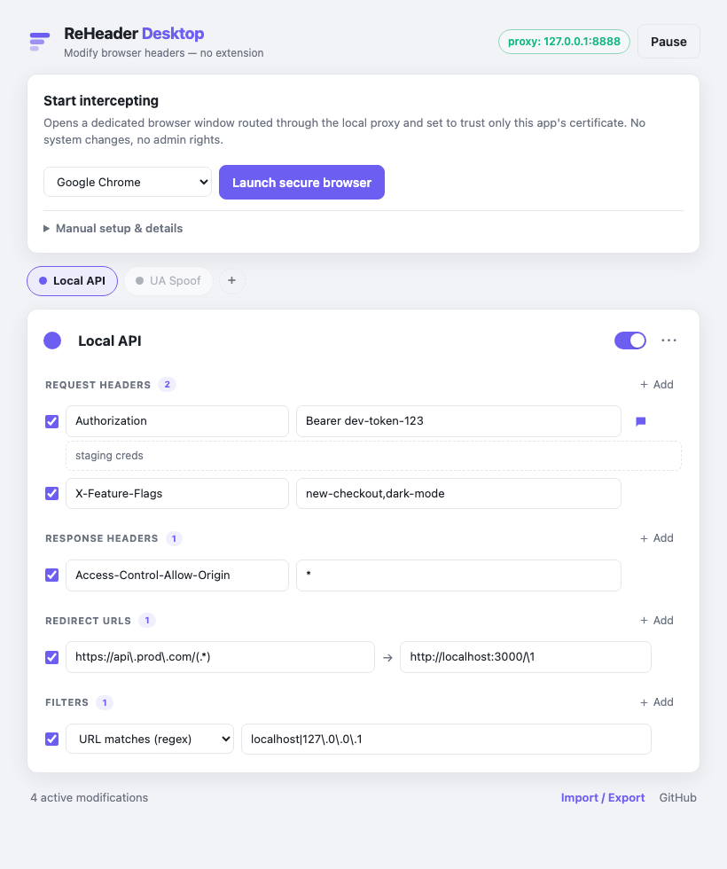

# ReHeader Desktop

**Modify HTTP request & response headers in any browser — with no browser
extension, no system proxy change, and no admin rights.** Built for locked-down
environments where extensions are blocked by policy.

<picture>
  <source media="(prefers-color-scheme: dark)" srcset="docs/panel-dark.png">
  
</picture>

ReHeader Desktop is a tiny local app (one self-contained binary, ~no
dependencies) that runs a local proxy and rewrites headers in flight — the same
approach Charles Proxy and Fiddler use. It's the companion to the
[ReHeader browser extension](https://github.com/amishraj/reheader); profiles are
interchangeable between them.

## Why this exists

Header-modifying browser extensions (like ModHeader) are increasingly blocked by
corporate policy — and ModHeader itself
[shipped spyware](https://github.com/amishraj/reheader#why-you-can-trust-it) and
was pulled from the Chrome Web Store. A local proxy is a completely different
mechanism, so an extension-install policy doesn't stop it.

## The locked-down-friendly design

Modifying **HTTPS** traffic normally requires installing a trusted root
certificate — which locked-down machines often block (it needs admin). ReHeader
Desktop avoids that entirely:

1. It generates its own local certificate authority.
2. It launches a **dedicated browser window** pointed at the local proxy and
   told — via Chromium's `--ignore-certificate-errors-spki-list` flag — to trust
   **only** this app's certificate, identified by its public-key hash.

The result: **no system proxy setting is changed, no certificate is installed,
and no admin rights are needed.** Your normal browser windows are untouched; only
the dedicated window routes through ReHeader.

> This is verified end-to-end in testing: real Chrome, nothing installed, loads
> an intercepted HTTPS page and sees the injected header.

## Install

1. Download the binary for your OS from
   [Releases](https://github.com/amishraj/reheader-desktop/releases):
   - macOS Apple Silicon: `reheader-desktop-aarch64-apple-darwin`
   - macOS Intel: `reheader-desktop-x86_64-apple-darwin`
   - Linux: `reheader-desktop-x86_64-unknown-linux-gnu`
   - Windows: `reheader-desktop-x86_64-pc-windows-msvc.exe`
2. Run it:
   - **macOS/Linux:** `chmod +x reheader-desktop-* && ./reheader-desktop-*`
     (macOS may quarantine an unsigned download — if it refuses to open, run
     `xattr -d com.apple.quarantine ./reheader-desktop-*` first, or right-click →
     Open once.)
   - **Windows:** double-click the `.exe` (SmartScreen → *More info* → *Run
     anyway* for an unsigned build).
3. The control panel opens at <http://127.0.0.1:8889>. Add your headers, then
   click **Launch secure browser**. Use that window for your requests.

That's it — nothing is installed system-wide. To stop, press `Ctrl+C` in the
terminal (or close the app).

## Features

- Add / override / remove **request headers** and **response headers**
  (empty value = remove the header)
- **Redirect URLs** by regex, with `\1…\9` capture groups
- **Multiple profiles** with colors, cloning, and one-click switching; all
  enabled profiles apply at once
- **Filters** — apply a profile only to URLs matching a regex, or exclude URLs
- **Per-header comments**, header-name autocomplete
- **Import / export** JSON — including profiles exported from the ReHeader
  extension **and from ModHeader**
- **Pause** everything; live count of active modifications; light / dark themes
- One-click launch for **Chrome, Edge, Brave, Arc**, or any Chromium

## Prefer to configure it yourself?

Open **Manual setup & details** in the control panel. You can point any browser's
HTTP/HTTPS proxy at `127.0.0.1:8888` and either:

- **Install the CA** (`Download reheader-ca.pem`) into your trust store — works
  for every browser, but may need admin; or
- **Launch a Chromium browser with the SPKI pin** shown there — no install
  needed. The exact command line is displayed for you to copy.

## How it works

```
 browser ──HTTP/HTTPS──▶ 127.0.0.1:8888 (local proxy) ──▶ real server
                              │
                    applies your header rules
```

The proxy is a MITM proxy built on [hudsucker](https://github.com/omjadas/hudsucker).
For HTTPS it terminates TLS using a leaf certificate signed by the local CA;
because every leaf reuses the CA's key, a single pinned SPKI hash trusts all
intercepted hosts. Rule matching (`src/rules.rs`) is a pure, unit-tested module
shared with nothing external.

### Notes & limitations

- **Filters/redirects use Rust `regex`** (RE2-style, no backreferences in the
  pattern). Redirect targets use `\1…\9` for capture groups. If every include
  filter on a profile is invalid, the profile is disabled rather than applied
  everywhere.
- **Redirects** are implemented as `307 Temporary Redirect` responses (the
  browser re-requests the new URL).
- **Resource-type filters** (XHR, image, …) from the extension format are
  accepted on import but ignored — a proxy can't reliably reconstruct the
  browser's resource classification. URL filters cover most cases.
- Some hop-by-hop headers are managed by the network stack and can't be
  overridden.
- The proxy binds to `127.0.0.1` only. Your CA private key lives in the app's
  data directory (`~/Library/Application Support/ReHeaderDesktop` on macOS,
  `~/.local/share/ReHeaderDesktop` on Linux, `%APPDATA%` on Windows), readable
  only by you. Anyone with that key could MITM your dedicated browser, so keep it
  private; delete the folder to reset.

## CLI

```
reheader-desktop [--proxy-port 8888] [--ui-port 8889]
                 [--data-dir <path>] [--launch chrome|edge|brave|arc]
```

`--launch` also opens the pre-configured browser on startup.

## Build from source

Requires a Rust toolchain (and a C compiler + CMake, for the TLS backend).

```sh
cargo test --lib     # fast, pure rule-engine tests
cargo build --release
./target/release/reheader-desktop
```

The web UI is embedded into the binary at build time, so the release binary is
fully self-contained.

## License

[MIT](LICENSE)
